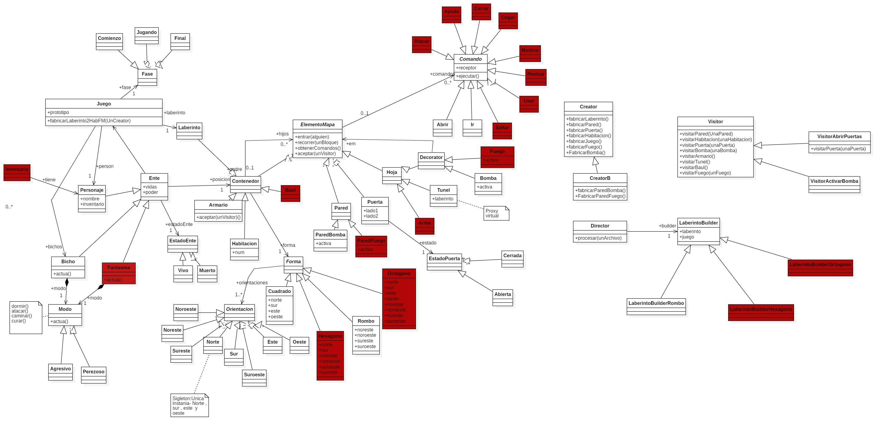

#LABERINTO 25
Este es el proyecto de la asignatura de diseño de Software del curso 24-25

El proyecto consiste en diseñar e implementar la logica de un juego de un laberinto en Python

Hemos añadido un serie de modificaciones a la version original que hemos implementado en clase.

## **Modificaciones**
- Se ha añadido un nuevo ente, ese ente va a ser un fantasma.
- Se han añadido 2 nuevas formas al laberinto, ademas del cuadrado y del rombo, hemos añadido un hexagono y un octogono.
- Ademas de se ha creado el laberintobuilder de cada una de las formas que hemos añadido, para que se puede ejecutar el json
  correspondiente.
- Ademas del armario que ya teniamos creado, hemos creado un baul.
- He añadido un nuevo decorator mas que la bomba, que es fuego. Cada uno de estos decoratos se van a añadir como items al armario
  y al baul que al abrirlos, hara daño al personaje.
- Hemos añadido una nueva hoja que es la arma, que tiene un poder adicional que se va a añadir al personaje cuando se usa.
- Tambien hemos añadido un inventario para el personaje, que tiene una capacidad de 5 items iniciales, y ademas de los items
  que se van a añadir al inventario, se van a añadir los items que tiene el personaje cuando se usa la arma.
- Tambien hemos añadido varios comandos como son soltar, usar, cerrar, atacar, ayuda, coger, mostrar y revisar. Todo esto se va a procesar
  a traves de la clase ProcesadorComandos.

## **Diagrama de clases**

