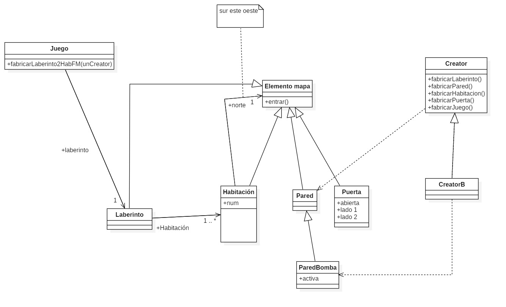
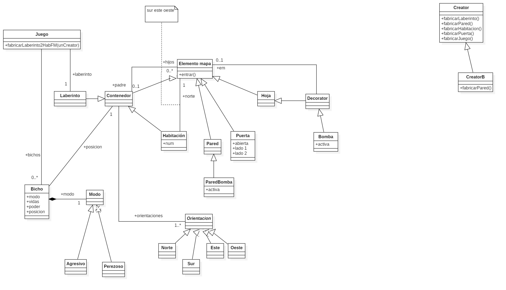
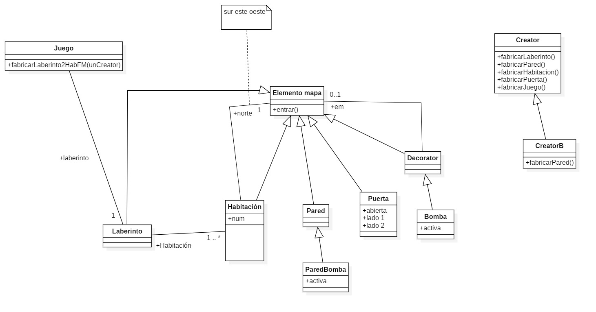
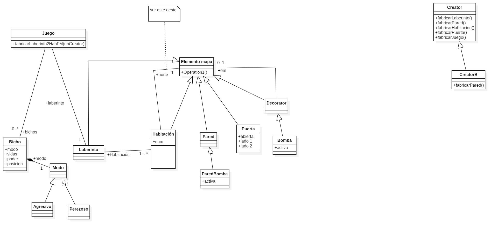

#LABERINTO 25
Este es el proyecto de la asignatura de diseño de Software del curso 24-25

El proyecto consiste en diseñar e implementar la logica de un juego de un laberinto en Python

## **Factory Method**
Este patrón encapsula la creación de objetos, permitiendo que cada tipo de laberinto pueda ser instanciado sin modificar 
la lógica principal del juego. A continuacion, se muestra el diagrama de clases:

## **Composite**
Este patrón se utiliza para representar estructuras recursivas todo-parte.
Permite que elementos individuales y estructuras compuestas sean tratadas de manera uniforme.
En nuestro juego, se aplica en la construcción del Laberinto. A continuacion, se muestra el diagrama de clases:

## **Decorator**
Con este patrón podemos agregar responsabilidades nuevas a otros objetos sin modificar su estructura base. Se usa 
para añadir la funcionalidad de Bomba a elementos del laberinto como paredes. A continuacion, se muestra el diagrama de clases:

## **Strategy**
El patrón Strategy encapsula familias de algoritmos como objetos intercambiables. En nuestra solución, 
se aplica para definir los diferentes modos de comportamiento de los bichos. A continuacion, se muestra el diagrama de clases:

